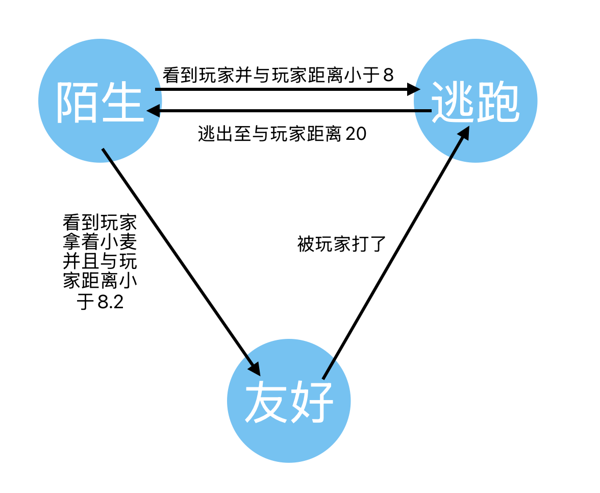
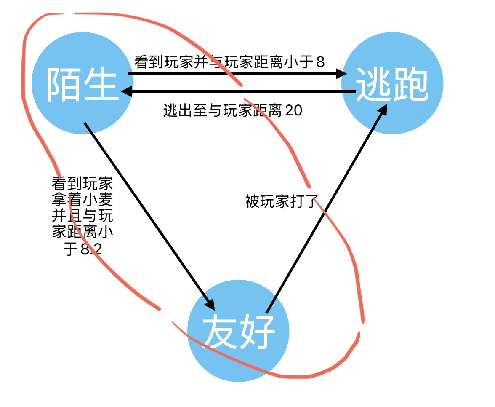
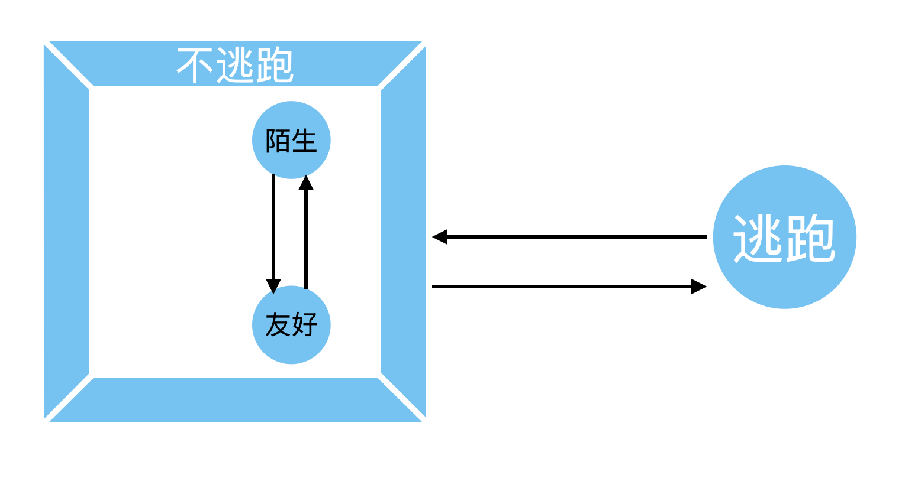
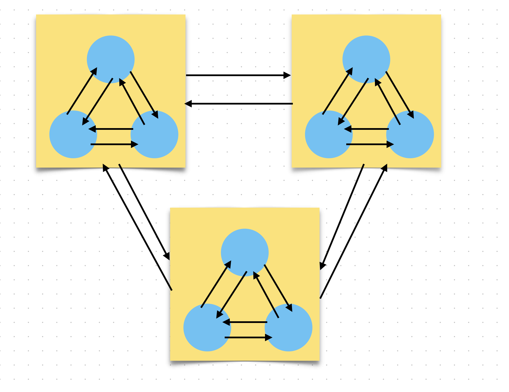
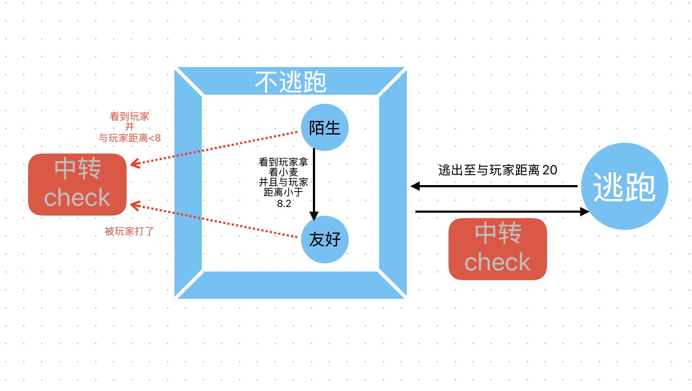

> 祝生物钟倒转的三天新年快乐🎆

基于上次的状态机：

之前说过我当时写出这个状态机时，是从最初的if-else重构过来的。

所以当时新接触这个状态机时，我也尝试过从if-else的角度去反向理解这个教简单的状态机，然后误打误撞就发现这其实就是分层状态机（HFSM）的思想

事实上把陌生和友好两个状态合并起来就是对应着本的'false',而逃跑状态则对应原本的'true'

或者换句话说： **if-else本身就是一种广义上的二元状态机**

同时，在我们的这个例子中，我们用抽象的思维看，其实'陌生和友好'本身也是一个二元的状态机，它作为一个状态机被封装成了大的if-else二元状态机下的一个状态。

也就是说：
**状态机中的状态可以是另一个状态机**

**这也就是分层状态机HFSM**

我们把之前的FSM重构为HFSM,它总体上大致长这样

hfsm的运行逻辑是先进入父状态机，然后根据过渡条件选择对应的子状态机，再运行子状态机并进入子状态机下的状态。

各层级内需要做好抽象屏障，子状态机的状态不应与父状态机的状态存在任何通信。

以下是HFSM的一个通用模型

对于我们这个例子：

父状态机是‘逃跑-不逃跑’，存在的子状态机是‘陌生-友好’。

在由原先的FSM重构为HFSM的过程中，
状态之间原本都是直接通信
为了防止破坏层级抽象
实际上对于这个例子具体实现上需要一点特殊处理

即通过外部的一个中转Boolean来让‘不逃跑’跳转到‘逃跑’,而不是直接从‘友好’或者‘陌生’跳转到‘逃跑’。

当然,需要这样去操作也说明在构建hfsm时‘友好’和‘陌生’就不适合被分到同一状态机下，而且这个例子其实也没必要使用HFSM，只是为了从FSM引出HFSM而已。

HFSM真正的适用场景是在FSM的状态数量已经达到非常多时，难以管理，遂把各个小状态依据关联性分类并组装成一个个子状态机，然后嵌入到父状态机中，可以进行很多层的封装。

* 代码实现可以参考https://zhuanlan.zhihu.com/p/558422986
