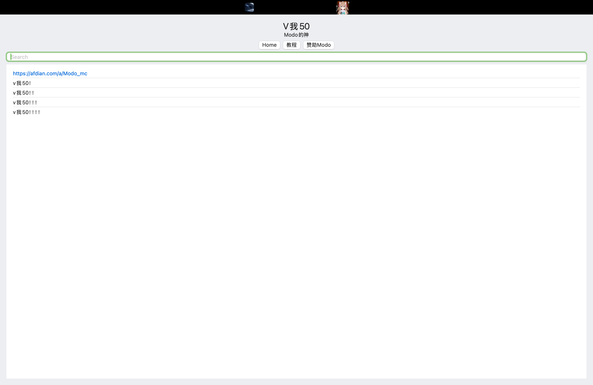

用Swift写了一个从后端获取数据来展示话题和评论的Mac客户端, 用了MVVM模式

### MVVM即Model、View和ViewModel

- View层:
    
    **UI界面，对的，记住它就仅仅是个UI**

- ViewModel层:

    **View要用到的所有数据和方法，嗯，data和function，所以它在Swift中通常是个class**

- Mode层l:

    **底层数据和业务逻辑，在这个例子中包括向后端发出请求的底层方法，以及对应得到的json数据转换为的结构体**
    
### 用ViewModel是为了视图和业务逻辑之间的解耦

从我的项目文件结构中应该能更加清晰说明这个：

    -CommentSystem
            
        -PageModel.swift
                
            -PageService.swift
                
            -PageData.swift
                
        -PageViewModel.swift
                
        -PageView.swift
                
                
                
>  *" **the View “knows” about the VM, but the VM knows nothing of the View. This is the blindest date ever** "* 
    
MVVM实现的是单向数据流，Model提供接口给到ViewModel,再通过ViewModel提供接口给到View

### Swift中的实现

Model是底层上通用的一些数据和业务逻辑，自然就不用多提了

#### 重点是ViewModel:
以下为这个项目的实现
```swift
import SwiftUI
import Combine

public class PageViewModel: ObservableObject {
    @Published private(set) var title: String = ""
    @Published private(set) var contents: String = ""
    @Published private(set) var posts: [Post] = []
    @Published private(set) var errorMessage: String?
    @Published private(set) var cteateTime: Int64 = 0
    
    private let service: PageServiceProtocol
    
    init(service: PageServiceProtocol) {
        self.service = service
    }
    
    func loadPageById(input: Int) {
        Task{
            await load(pageId: input)
        }
    }
    
    func loadPageByTopic(input: String){
        Task{
            await query(title: input)
        }
    }
    
    private func query(title: String) async {
        do {
            let idData = try await service.fetchTopicId(title: title)
            await load(pageId: idData.id)
        } catch {
            self.errorMessage = error.localizedDescription
        }
    }
    
    private func load(pageId: Int) async {
        do {
            let pageData = try await service.fetchPage(Id: pageId)
            
            self.title = pageData.data.Topic.title
            self.posts = pageData.data.PostList
            self.cteateTime = pageData.data.Topic.create_time
            self.contents = pageData.data.Topic.content
            
        } catch {
            self.errorMessage = error.localizedDescription
        }
    }
}

```
我们把ViewModel直接作为一个类，
并使用ObservableObject*来定义它，待会儿在View中就可以用ObservedObject来监听它的ViewModel，@Published是你要向上开放的字段，也就是View要访问的字段，而**func loadPageById**和**func loadPageByTopic**则是View要使用的逻辑方法

在这段中可以注意到的一点是
```swift
init(service: PageServiceProtocol) {
        self.service = service
    }
```
这里用到的service就是由Model提供上来的接口，viewModel中的所有字段和方法均由Model提供的数据和方法来实现

#### 接下来是View去调用
原项目ui代码太多太杂了，以下为一个简化过了的实现：
```swift
import SwiftUI

public struct ContentView: View {
    
    @ObservedObject var viewModel: PageViewModel
    @State private var input = ""
    
    public var body: some View {
        VStack {
            Text(viewModel.title)
                .font(.title)
            if viewModel.contents.isEmpty {
                Text("Loading...")
            } else {
                Text(viewModel.contents)
            }
            HStack {
                Button("Home") { viewModel.loadPageById(input: 1) }
                Button("教程") { viewModel.loadPageById(input: 3) }
                Button("赞助Modo") { viewModel.loadPageById(input: 2) }
            }
            TextField("Search", text: $input)
                .textFieldStyle(.roundedBorder)
                .onSubmit {
                    viewModel.loadPageByTopic(input: input)
                }
            
            List(viewModel.posts, id: \.content) { post in
                if let url = URL(string: post.content),
                   url.scheme?.hasPrefix("http") == true {
                    Link(post.content, destination: url)
                } else {
                    Text(post.content)
                }
            }
        }
        .padding()
        .onAppear {
            viewModel.loadPageById(input: 1)
        }
    }
}
```

通过@ObservedObject监听ObservableObject即ViewModel的变化
当@Published变量改变时刷新View

public var body: some View{···}中的内容为具体的界面ui，可以看到全都采用ViewModel实例提供的数据和方法来实现

ui界面如下：

